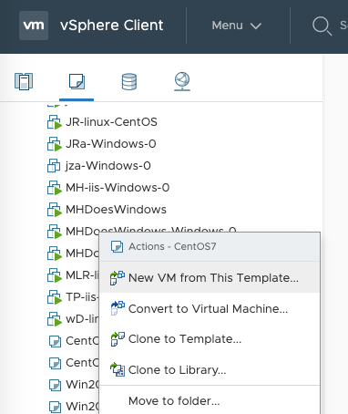
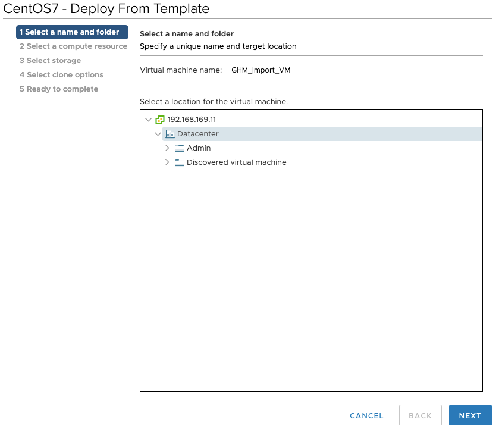
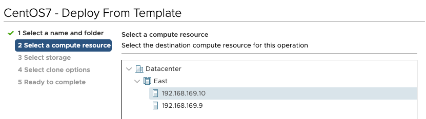
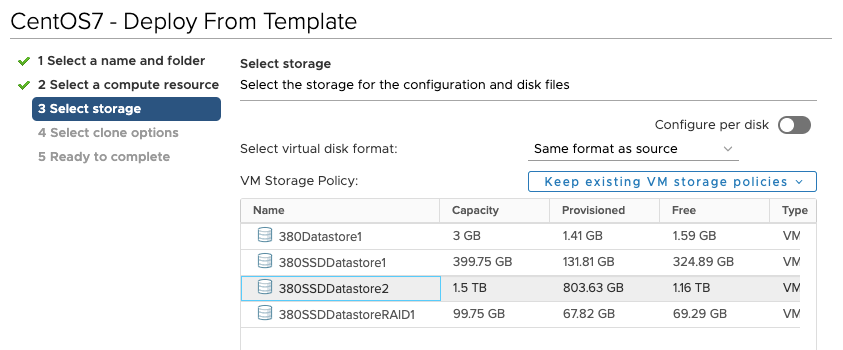
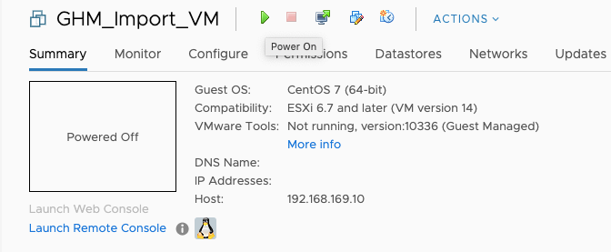
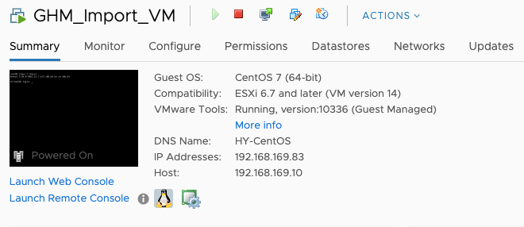

# Lab 14: Importing VM into Terraform

## Expected Outcome

You will use Terraform to import an exisiting VM into Terraform

In this challenge, you will:

- Run an `import` to bring an existing VM into Terraform state 
- Run a `plan` on simple a simple resource
- Run an `apply` to create Azure infrastructure
- Run a `destroy` to remove Azure infrastructure

## How To

### Create Terraform Configuration

Change directory into a folder specific to this challenge.

For example: `cd /import/`.

Create an empty file named `main.tf`.

---

## How To

### Create Infrastructure in the Portal

Navigate to vSphere and right click on the "CentOS7" template and select "New VM from this Template":



Give the VM a name with your initials.  `Initials_Import_VM` and select `Next` 



Select a one of the ESXi hosts within the `East` cluster and select `Next`



Select one of `SSD` datastores and select `Next`



Keep the defaults for the remaining screens and select `Finish` 

Once the VM has been created, then power it on.



At this point we have a VM that is ready to into Terraform.



### Create Terraform Configuration

We will now add `resource` blocks to represent the infrastructure we are about to import.

We have one resource that we need to import into our Terraform Configuration, to do this we need to do two things:

1. Create the base Terraform configuration for the resource.
2. Run `terraform import` to bring the VM into our state file.

To create the base configuration place the following code into the `main.tf` file.

```hcl
provider "vsphere" {
  user           = "<VSPHERE_USERNAME>"
  password       = "<VSPHERE_PASSWORD>"
  vsphere_server = "<VSPHERE_SERVER>"

  # If you have a self-signed cert
  allow_unverified_ssl = true
}

data "vsphere_datacenter" "dc" {
  name = "Datacenter"
}

data "vsphere_compute_cluster" "cluster" {
  name          = "East"
  datacenter_id = data.vsphere_datacenter.dc.id

}

data "vsphere_datastore" "datastore" {
  name          = "<VSPHERE_DATASTORE>"
  datacenter_id = data.vsphere_datacenter.dc.id
}

data "vsphere_network" "network" {
  name          = "VM Network"
  datacenter_id = data.vsphere_datacenter.dc.id
}
```

### Import the VM

We need two values to run the `terraform import` command:

1. vSphere DataCenter
1. Server Name

Now run the import command:
```text
terraform import vsphere_virtual_machine.vm /Datacenter/vm/GHM_Import_VM
Error: resource address "vsphere_virtual_machine.vm" does not exist in the configuration.

Before importing this resource, please create its configuration in the root module. For example:

resource "vsphere_virtual_machine" "vm" {
  # (resource arguments)
}
```
Notice that Terraform will error if you have not added the appropriate resource into your configuration file.  Remember why?  What happens if you have an item in state but not in your configuration?  Bad things - it will destroy the VM at the next apply.  This is a safety check to be sure that anything you `import` you put into your configuration to manage.

Let's add the appropriate configuration into our main.tf:

```hcl
resource "vsphere_virtual_machine" "vm" {
  name             = "GHM_Import_VM"
  resource_pool_id = data.vsphere_compute_cluster.cluster.resource_pool_id
  datastore_id     = data.vsphere_datastore.datastore.id

  num_cpus = 2
  memory   = 2048
  guest_id = "centos7_64Guest"

  network_interface {
    network_id = data.vsphere_network.network.id
  }

  disk {
    label = "disk0"
    size  = 16
    thin_provisioned = false
  }
}
```
And re-run our import

```sh
$ terraform import vsphere_virtual_machine.vm /Datacenter/vm/GHM_Import_VM

vsphere_virtual_machine.vm: Importing from ID "/Datacenter/vm/GHM_Import_VM"...
vsphere_virtual_machine.vm: Import prepared!
  Prepared vsphere_virtual_machine for import
vsphere_virtual_machine.vm: Refreshing state... [id=4208e5bf-e316-75a6-3878-7be5ce34b0f9]

Import successful!

The resources that were imported are shown above. These resources are now in
your Terraform state and will henceforth be managed by Terraform.
```

### Verify Plan

Run a `terraform plan`, you should see changes to make this conform to your standard VM deployment:

```sh
$ terraform plan

...

Plan: 0 to add, 1 to change, 0 to destroy.
```

This means that Terraform detected some differences between your
configuration and real physical resources that exist. As a result at the next apply it will make the appropraite changes to have the VM conform to your standards.


Run `terraform apply`.

SUCCESS! You have now brought existing infrastructure into Terraform.

### Cleanup

When you are done, destroy the infrastructure, you no longer need it.vvBecause the infrastructure is now managed by Terraform, we can destroy just like before.

Run a `terraform destroy` and follow the prompts to remove the infrastructure.

## Resources

- [Terraform Import](https://www.terraform.io/docs/commands/import.html)
