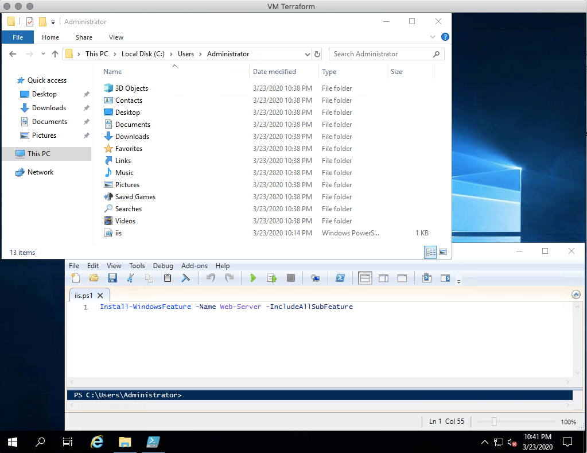
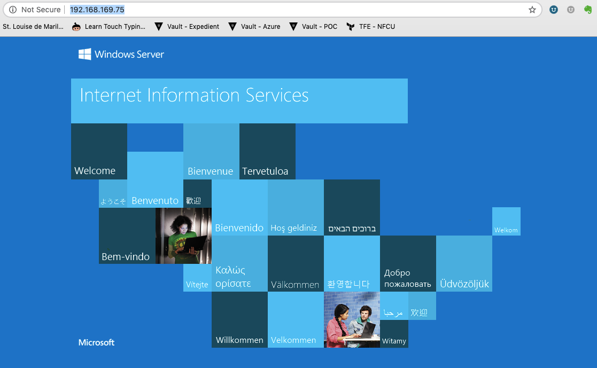

# Lab 10: Terraform Provisioners - Windows

Duration: 30 minutes

In this lab you will create a Virtual Machine but this time layer in Terraform Provisioners to configure the machines as part the Terraform apply.

- Task 1: Define a Provisoner
- Task 2: Running Provisoners
- Task 3: Cleanup
- Task 4: Failed provisioners and tainted resources
- Task 5: Destroy Provisoners

Terraform [provisioners](https://www.terraform.io/docs/provisioners/index.html) help you do additional setup and configuration when a resource is created or destroyed. You can move files, run shell scripts, and install software.

Provisioners are not intended to maintain desired state and configuration for existing resources. For that purpose, you should use one of the many tools for configuration management, such as [Chef](https://www.chef.io/chef/), [Ansible](https://www.ansible.com/), and PowerShell [Desired State Configuration](https://docs.microsoft.com/en-us/powershell/dsc/overview/overview). (Terraform includes a [chef](https://www.terraform.io/docs/provisioners/chef.html) provisioner.)

An imaged-based infrastructure, such as images created with [Packer](https://www.packer.io), can eliminate much of the need to configure resources when they are created. In this common scenario, Terraform is used to provision infrastructure based on a custom image. The image is managed as code.

## Task 1: Define a Provisoner
### Step 10.1.1
Provisioners are defined on resources, most commonly a new instance of a virtual machine or container.

The complete configuration for this example is given below. By now, you should be familiar with most of the contents.

Notice that the vsphere_virtual_machine resource contains two provisioner blocks:

```hcl
resource "vsphere_virtual_machine" "windows_vm" {

    <...snip...>

  provisioner "file" {
    connection {
      type     = "winrm"
      user     = "Administrator"
      password = var.windows_admin_password
      host     = vsphere_virtual_machine.windows_vm[0].default_ip_address
      use_ntlm = "true"
    }

    source      = "iis.ps1"
    destination = "iis.ps1"
  }

  provisioner "remote-exec" {
    connection {
      type     = "winrm"
      user     = "Administrator"
      password = var.windows_admin_password
      host     = vsphere_virtual_machine.windows_vm[0].default_ip_address
      use_ntlm = "true"
    }

    inline = [
      "powershell.exe Install-WindowsFeature -Name Web-Server -IncludeAllSubFeature"
    ]

  }
}
```

As this example shows, you can define more than one provisioner in a resource block. The [file](https://www.terraform.io/docs/provisioners/file.html) and [remote-exec](https://www.terraform.io/docs/provisioners/remote-exec.html) providers are used to perform two simple setup tasks:

-   File copies a powershell file from the machine that is running Terraform to the new VM instance.
-   Remote-exec runs commands to run a powershell command to install IIS.

Both providers need a [connection](https://www.terraform.io/docs/provisioners/connection.html) to the new virtual machine to do their jobs. To simplify things, the example uses password authentication. In practice, you are more likely to use SSH keys or WinRM connections.

## Task 2: Running Provisioners

### Step 10.2.1

Provisioners run when a resource is created, or a resource is destroyed. Provisioners do not run during update operations. The example configuration for this section defines two provisioners that run only when a new virtual machine instance is created. If the virtual machine instance is later modified or destroyed, the provisioners will not run.

Although we don't show it in the example configuration, there is a way to define provisioners that run when a resource is destroyed.

To run the example configuration with provisioners:
1.  Create a folder under modules called `iis_windows_vm`
1.  Copy the `main.tf` from `my_windows_vm` into this directory.
1.  Update the `main.tf` under `iis_windows_vm` with the two provisoner stanzas which should be placed after the `annotation` stanza within the `"vsphere_virtual_machine" "windows_vm"` resource block
```
 provisioner "file" {
    connection {
      type     = "winrm"
      user     = "Administrator"
      password = var.windows_admin_password
      host     = vsphere_virtual_machine.windows_vm[0].default_ip_address
      use_ntlm = "true"
    }

    source      = "iis.ps1"
    destination = "iis.ps1"
  }

  provisioner "remote-exec" {
    connection {
      type     = "winrm"
      user     = "Administrator"
      password = var.windows_admin_password
      host     = vsphere_virtual_machine.windows_vm[0].default_ip_address
      use_ntlm = "true"
    }

    inline = [
      "powershell.exe Install-WindowsFeature -Name Web-Server -IncludeAllSubFeature"
    ]

  }
```
1. Create a file named `iis.ps1` in the root directory and add the following text: 
    ```powershell
    Install-WindowsFeature -Name Web-Server -IncludeAllSubFeature
    ``` 
1. Save the file and close the editor.
1. Update the `main.tf` in the root directory to remove all modules.
1. Update the `main.tf` in the root directory to add the following module:

```hcl
module "myawesomewindowsvm-iis" {
  source           = "./modules/iis_windows_vm"
  prefix           = "${var.prefix}-iis"
  vcpus            = var.vcpus
  memory           = var.memory
  datastore        = var.datastore
  windows_template = var.windows_template
  windows_count    = 1
  tag_tier         = "Bronze"
  tag_release      = "Windows 2019 - FY2020 Q1 Release - IIS"
}
```
1.  Save all files
1.  Run `terraform init`
1.  Run `terraform plan`
1.  Run `terraform apply`. When prompted to continue, answer `yes`.

The following sample output has been truncated to show only the end of the output added by the provisioners (your actual output may differ slightly):

```
...

module.myiisvm.vsphere_virtual_machine.windows_vm[0] (remote-exec): Success Restart Needed Exit Code      Feature Result
module.myiisvm.vsphere_virtual_machine.windows_vm[0] (remote-exec): ------- -------------- ---------      --------------
module.myiisvm.vsphere_virtual_machine.windows_vm[0] (remote-exec): True    No             Success        {ASP.NET 4.7, .NET Framework 3.5 (includes...


module.myiisvm.vsphere_virtual_machine.windows_vm[0]: Creation complete after 17m7s [id=42086973-a9c6-3b4b-a03e-d81e5b7a4442]

Apply complete! Resources: 1 added, 0 changed, 1 destroyed.!

```

## Task 3: Validate and Clean up

### Step 10.3.1
1. Validate you can see the `iis.ps1` file on your windows VM



and/or

1. Browse to the IP Address of the Windows VM in your browser to see the default IIS web page.



### Step 10.3.2
When you are done, run `terraform destroy` to remove everything we created

## Task 4:  Failed provisioners and tainted resources
### Step 10.4.1

Provisioners sometimes fail to run properly. By the time the provisioner is run, the resource has already been physically created. If the provisioner fails, the resource will be left in an unknown state. When this happens, Terraform will generate an error and mark the resource as "tainted." A resource that is tainted isn't considered safe to use.

When you generate your next execution plan, Terraform will not attempt to restart provisioning on the tainted resource because it isn't guaranteed to be safe. Instead, Terraform will remove any tainted resources and create new resources, attempting to provision them again after creation.

You might wonder why Terraform doesn't destroy the tainted resource during apply, to avoid leaving a resource in an unknown state. Terraform doesn't roll back tainted resources because that action was not in the execution plan. The execution plan says that a resource will be created, but not that it might be deleted. If you create an execution plan with a tainted resource, however, the plan will clearly state that the resource will be destroyed because it is tainted.


## Task 5: Destroy Provisoners

Provisioners can also be defined that run only during a destroy operation. These are known as [destroy-time provisioners](https://www.terraform.io/docs/provisioners/index.html#destroy-time-provisioners). Destroy provisioners are useful for performing system cleanup, extracting data, etc.

The following code snippet shows how a destroy provisioner is defined:

```
provisioner "remote-exec" {
    when = "destroy"

    <...snip...>

```