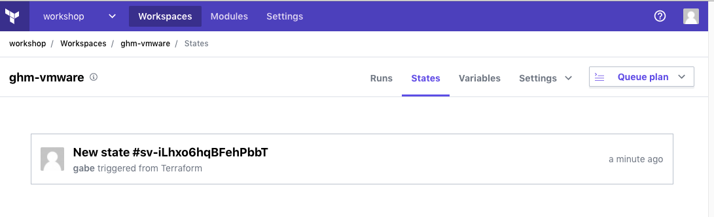

# Lab 13: Terraform State - Migrate to Terraform Enterprise

Duration: 15 minutes

In this lab you will tranistion from Local to Remote State using Terraform Enterprise

- Task 1: Login to Terraform Enterprise
- Task 2: Create Terraform remote backend configuration for Terraform Enterprise
- Task 3: Initialize Terraform Enterprise Remote backend
- Task 4: Copy State from Local to Terraform Enterprise backend

With remote state, Terraform writes the state data to a remote data store, which can then be shared between all members of a team. Terraform supports storing state in Terraform Enterprise, Terraform Cloud, HashiCorp Consul, Amazon S3, and more. Remote state is a feature of backends.

## Task 1: Login to Terraform Enterprise
### Step 13.1.1

Create a new user in Terraform Enterprise

https://tfe-nfcu.digitalinnovation.dev/

```sh
terraform login tfe-nfcu.digitalinnovation.dev 
```

Follow the prompts and generate and validate an API key.

Create a Workspace under the Workshop organization that is unique to you.

https://tfe-nfcu.digitalinnovation.dev/app/workshop/workspaces

Click on `New Workspace`


Select `No VCS connection`


Name your `Workspace`


Click on `Create Workspace`


## Task 2: Create Terraform remote backend configuration for Terraform Enterprise
### Step 13.1.1

Create a new file called `backend.tf` with the following configuration 

```hcl
terraform {
  backend "remote" {
    hostname = "tfe-nfcu.digitalinnovation.dev"
    organization = "<YOUR_ORGANIAZTION_NAME>"

    workspaces {
      name = "<YOUR_WORKSPACE_NAME>"
    }
  }
}
```
Save your file.

## Task 3: Initialize Terraform Enterprise Remote backend
### Step 13.3.1

```sh
terraform init
```
```text
Initializing modules...

Initializing the backend...
Do you want to copy existing state to the new backend?
  Pre-existing state was found while migrating the previous "local" backend to the
  newly configured "remote" backend. No existing state was found in the newly
  configured "remote" backend. Do you want to copy this state to the new "remote"
  backend? Enter "yes" to copy and "no" to start with an empty state.

  Enter a value:
```

Answer `yes` 

## Task 1: Copy State from Local to Terraform Enterprise backend
### Step 13.3.1

```text
Enter a value: yes

Releasing state lock. This may take a few moments...

Successfully configured the backend "remote"! Terraform will automatically
use this backend unless the backend configuration changes.

```

Validate you can see the state file now underneath your workspace.



Run a `terraform plan` to validate no changes are 
