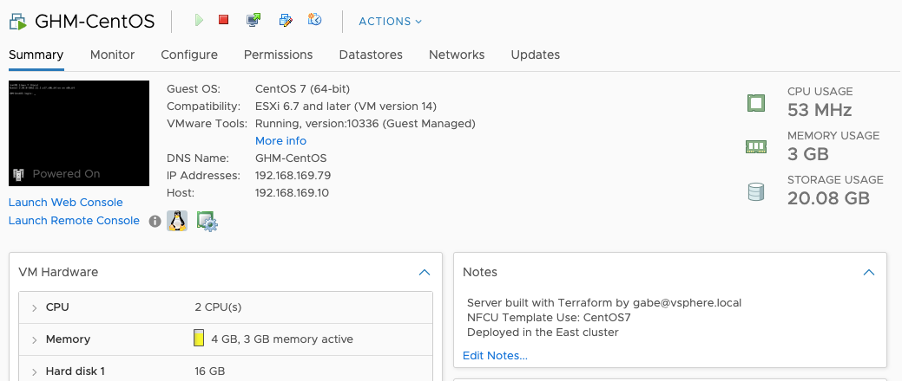

# Lab 17: Template Provider

Duration: 20 minutes

This lab demonstrates how to define and render a text template with the `templatefile` function.

- Task 1: Create a Terraform configuration that contains a template to be rendered
- Task 2: Use `templatefile` function to render variables into the template
- Task 3: Update VM notes with the rendered template.

## Task 1: Create a Terraform configuration that contains a template to be rendered

You'll create a VM and then add a template resource to be used to add to the VM Notes.

### Step 17.1.1: Create a VM using Terraform

Create a directory for the Terraform configuration. Create a sub-directory for templates. Create a template file.

For example: `/terraform/lab9-templates` which contains:
```sh
├ main.tf
├ terraform.tfvars
└── templates
    └── notes.tpl
```
The name of the template file is completely up to you. We like to include `tpl` to identify it as a template.

The contents of the `main.tf` and corresponding `terraform.tfvars` will look like this:

`main.tf`
```hcl
variable "vsphere_ip" {}
variable "username" {
  default = "administrator@vsphere.local"
}
variable "password" {}
variable "datacenter" {}
variable "cluster" {}
variable "datastore" {}
variable "network" {}
variable "server_name" {}
variable "vcpus" {}
variable "memory" {}
variable "disk_size" {}
variable "linux_template" {}
variable "linux_admin_password" {}

provider "vsphere" {
  user                 = var.username
  password             = var.password
  vsphere_server       = var.vsphere_ip
  allow_unverified_ssl = true
}

data "vsphere_datacenter" "dc" {
  name = var.datacenter
}

data "vsphere_compute_cluster" "cluster" {
  name          = var.cluster
  datacenter_id = data.vsphere_datacenter.dc.id
}

data "vsphere_datastore" "datastore" {
  name          = var.datastore
  datacenter_id = data.vsphere_datacenter.dc.id
}

data "vsphere_network" "network" {
  name          = var.network
  datacenter_id = data.vsphere_datacenter.dc.id
}

data "vsphere_virtual_machine" "linux_template" {
  name          = "CentOS7"
  datacenter_id = data.vsphere_datacenter.dc.id
}

resource "vsphere_virtual_machine" "linux_vm" {
  name             = "${var.server_name}-CentOS"
  resource_pool_id = data.vsphere_compute_cluster.cluster.resource_pool_id
  datastore_id     = data.vsphere_datastore.datastore.id

  num_cpus  = var.vcpus
  memory    = var.memory
  firmware  = "bios"
  guest_id  = data.vsphere_virtual_machine.linux_template.guest_id
  scsi_type = data.vsphere_virtual_machine.linux_template.scsi_type

  network_interface {
    network_id   = data.vsphere_network.network.id
    adapter_type = data.vsphere_virtual_machine.linux_template.network_interface_types[0]
  }

  disk {
    label            = "disk0"
    size             = data.vsphere_virtual_machine.linux_template.disks.0.size
    eagerly_scrub    = data.vsphere_virtual_machine.linux_template.disks.0.eagerly_scrub
    thin_provisioned = data.vsphere_virtual_machine.linux_template.disks.0.thin_provisioned
  }

  clone {
    template_uuid = data.vsphere_virtual_machine.linux_template.id

    customize {
      linux_options {
        host_name = "${var.server_name}-CentOS"
        domain    = "test.internal"
        time_zone = "US/Eastern"
      }
      network_interface {}
    }
  }

  tags       = ["${vsphere_tag.tag_prod.id}", "${vsphere_tag.tag_linux.id}"]
  annotation = "Server built with Terraform - ${formatdate("DD MMM YYYY hh:mm ZZZ", timestamp())}"
}

resource "vsphere_tag_category" "category" {
  name        = "Server Tier - <YOUR INITIALS>"
  cardinality = "MULTIPLE"
  description = "Managed by Terraform"

  associable_types = [
    "VirtualMachine",
    "Datastore",
  ]
}

resource "vsphere_tag" "tag_prod" {
  name        = "Production"
  category_id = vsphere_tag_category.category.id
  description = "Production Environment - Managed by Terraform"
}

resource "vsphere_tag" "tag_linux" {
  name        = "CentOS 7"
  category_id = vsphere_tag_category.category.id
  description = "CentOS 7 Server - Managed by Terraform"
}

output "server_name" {
  value = vsphere_virtual_machine.linux_vm.name
}

output "server_memory" {
  value = vsphere_virtual_machine.linux_vm.memory
}

output "server_ip" {
  value = vsphere_virtual_machine.linux_vm.default_ip_address
}
```

`terraform.tfvars`
```hcl
vsphere_ip           = "<VSPHERE_IP>"
username             = "<VSPHERE_USERNAME>"
password             = "<VSPHERE_PASSWORD>"
datacenter           = "Datacenter"
cluster              = "East"
datastore            = "<VSPHERE_DATASTORE>"
network              = "VM Network"
server_name          = "<YOUR_INITIALS>"
vcpus                = "2"
memory               = "4096"
disk_size            = "20"
linux_template       = "CentOS7"
linux_admin_password = "P@ssw0rd01"
```

### Step 17.1.2: Write contents of template with some placeholders for variables

In the `notes.tpl` file let's create a standard set of Notes that we to attach to each of the VMs provisioned using Terraform. We can define the resource through Terraform interpolation and define those variables outside the template and avoid hardcoding variables into our policies for added usability.

Terraform interpolation syntax is used (such as `"${server_name}`). No prefix is needed (`var.` or `data.` or any other).

```text
Server built with Terraform by ${user_name} 
NFCU Template Used: ${template_name}
Deployed in the ${cluster_name} cluster
```

## Task 2: Use `templatefile` function to render variable values into the template
### Step 17.2.1: Render the template into an output
We'll write HCL code to render the template. Let's reference the template we just created by updating the `annotation` attribute of our VM.  Templates do not have access to all variables in a configuration. They must be explicitly passed with the `vars` block.

```hcl
resource "vsphere_virtual_machine" "linux_vm" {
  name             = "${var.server_name}-CentOS
 ...

annotation = templatefile("${path.module}/templates/notes.tpl", {
    user_name     = var.username
    template_name = var.linux_template
    cluster_name  = var.cluster
  })

...  
```

We also use `path.module` here for robustness in any module or submodule.

### Step 17.2.2: Render the template
Rendered template content may be used anywhere: as arguments to a module or resource, or executed remotely as a script.

Run the code with `terraform apply` and you will see the rendered template.

```shell
terraform init
```

```shell
terraform apply
```

```
Apply complete! Resources: 1 added, 0 changed, 0 destroyed.


Once the VM has been created you can validate the template rendered withe the correct values by looking at the `Notes` section of the provisioned VM.


